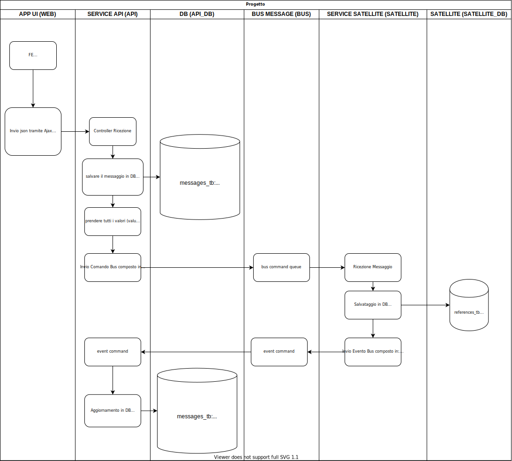

# I would like to submit a project to you which must be made up of the following requirements:

- Public GIT repository to be turned around on the first day
- Commented and punctual commits the project must always be buildable
- Documentation as detailed as possible for the developer with programs and procedures for the development of the project, so that he can test it on my premises
- The infrastructure is micro-services, functionalities and procedures are described in Project_flow.svg
  
